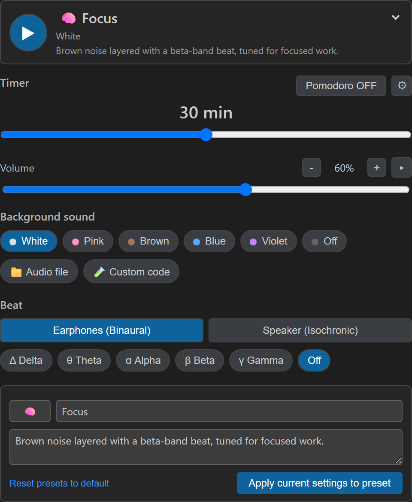
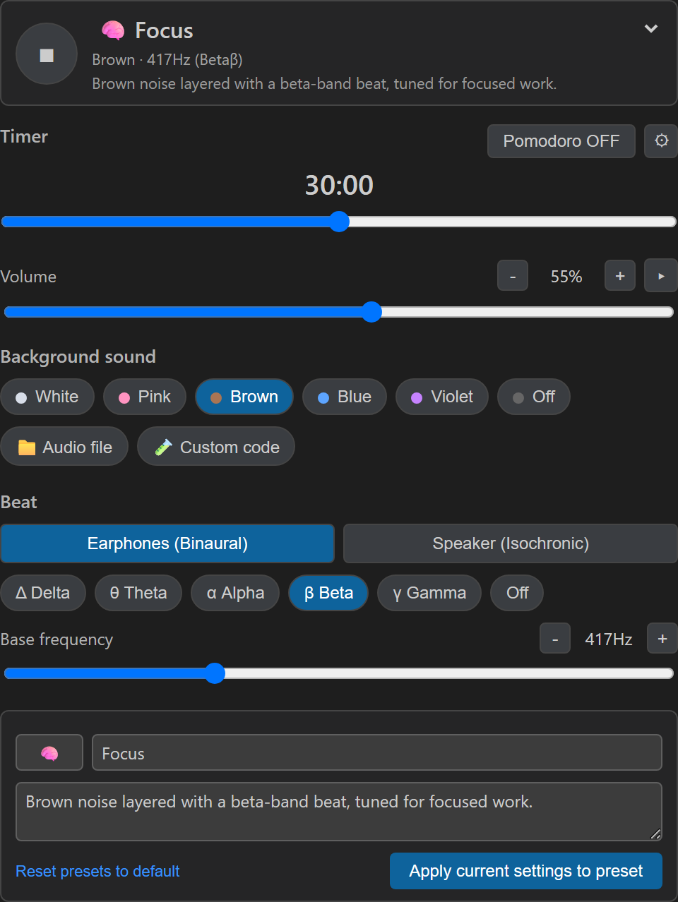
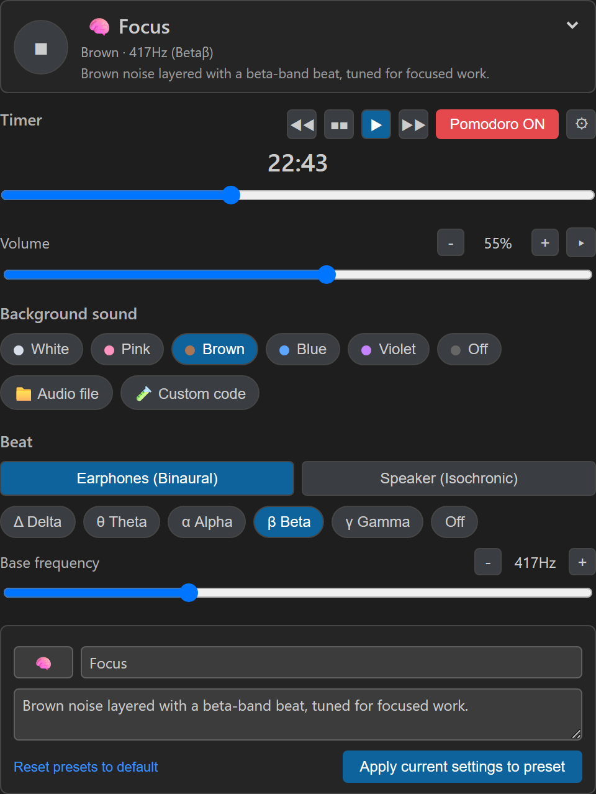
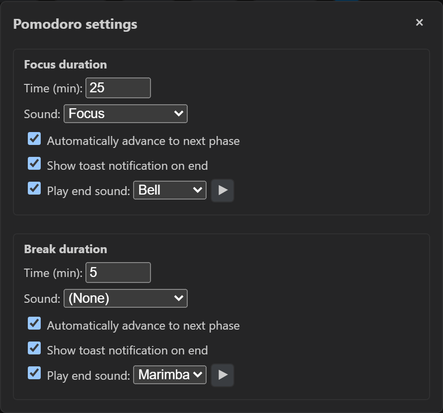

# Noise Pomodoro

[日本語](README.ja.md) | [Français](README.fr.md) | [中文](README.zh.md) | [Español](README.es.md)

Generates white, pink, and brown noise, isochronic tones, binaural beats, and solfeggio frequencies, with support for playing local audio files and running custom JavaScript waveform code. Includes a built-in Pomodoro timer that lets you assign a different sound to your focus and break periods.

## Screenshots

<table>
<tr>
<td align="center" width="25%"><br />Default view</td>
<td align="center" width="25%"><br />Preset playing</td>
<td align="center" width="25%"><br />Pomodoro running</td>
<td align="center" width="25%"><br />Pomodoro settings</td>
</tr>
</table>

## Features

- **Generated sound sources**: White, pink, and brown noise, isochronic tones, binaural beats, and solfeggio frequencies, all generated on an AudioWorklet for glitch-free playback during UI interaction.
- **File playback**: Play a local audio file of your choice.
- **Custom code**: Write a JavaScript expression using `t` (elapsed seconds) and `params` (arbitrary parameters) to generate a waveform in the range -1 to 1 and play it on the fly.
- **Pomodoro timer**: Set focus and break durations independently and assign a sound to each phase. Supports automatic phase switching, an end-of-phase toast, a one-shot chime, and custom scripts.
- **Status bar-first**: Open the panel from the status bar. Playback keeps running even when the panel is closed, and the status bar stays your control point even in Zen Mode.

## Usage

1. Click the status bar icon, or run "Noise Pomodoro: Open Panel" from the Command Palette, to open the panel.
2. Choose a sound preset to start playback.
3. In the Pomodoro section, set the focus/break durations and the sound for each phase, then press Start.

## Testing (for contributors)

If you're new to extension development, checking things in this order should help:

1. Run `npm install` in the terminal.
2. Run `npm run watch` so source changes rebuild automatically.
3. Press F5 in VS Code to launch the Extension Development Host.
4. In the new window, open the Command Palette and run "Noise Pomodoro: Open Panel".
5. Try the following in order:
	- Select a preset and confirm sound plays.
	- Confirm playback continues after closing the panel.
	- Confirm the status bar shows the name of the currently playing preset.
	- Operate the Pomodoro with Start / Pause / Reset / Skip and confirm the display and state stay in sync.
	- If a file-playback preset exists, confirm you can select and play a local audio file.
	- If custom code mode exists, enter a simple expression, apply it, and confirm an error message appears on failure.
6. To check logs, open the "Noise Pomodoro" output channel in VS Code.
7. After making changes, repeat verification in the F5 dev host: re-show the panel for UI changes, or wait for the watch rebuild and retest for implementation changes.

## Settings

- `noisePomodoro.enablePhaseEndScripts`: Allow custom scripts to run at phase end. Default `false`. Runs with extension host / Node privileges, so only use scripts you wrote yourself.
- `noisePomodoro.statusBar.updateIntervalMs`: Pomodoro status bar update interval, in milliseconds. Default `1000`.

## Development

```bash
npm install
npm run watch
```

Press F5 in VS Code to launch the Extension Development Host.
